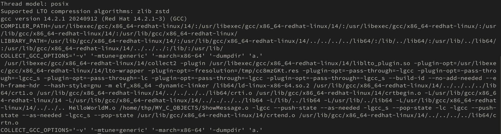

# Linking

Nella pratica i file oggetto contengono funzionalità che sono utilizzate da altri programmi. Un insieme di file oggetto formano una cosiddetta *libreria di codice*, la quale può essere statica (*static library*) oppure dinamica (*dynamic library*).

Una libreria statica ha le seguenti caratteristiche:

- è un file che ha in ambienti Unix-like un’estensione `.a` (*archive file*) e in ambienti Windows un’estensione `.lib` (*library file*);
- il file eseguibile ha incorporato il codice macchina delle funzioni eventualmente utilizzate il quale è copiato dal file oggetto della libreria relativa.

Una libreria dinamica ha le seguenti caratteristiche:

- è un file che ha in ambienti Unix-like un’estensione `.so` (*shared object*) e in ambienti Windows un’estensione `.dll` (*dynamic link library*);
- il file eseguibile non ha incorporato il codice macchina delle funzioni eventualmente utilizzate ma solo una tabella con i riferimenti di tali funzioni. Dopo che il programma è stato avviato, una funzione di caricamento cercherà a runtime il codice di quelle funzioni nei file di librerie dinamiche disponibili e lo caricherà in memoria per consentine l’utilizzo.

Per GCC in sistemi Unix-like i percorsi di ricerca delle librerie statiche o dinamiche sono usualmente `/usr/lib` (o `/usr/lib64` per sistemi a 64 bit) e `/lib` (o `/lib64` per sistemi a 64 bit). Per GCC in sistemi Windows (MinGW-w64 installato tramite MSYS2) i percorsi di ricerca delle librerie statiche o dinamiche possono essere in: `C:\msys64\mingw64\lib`, `C:\msys64\mingw32\lib`, `C:\msys64\ucrt64\lib` e `C:\msys64\ucrt64\lib\gcc\x86_64-w64-mingw32\[version]` (nel nostro sistema Windows 11 `[version]` è espanso con `14.1.0`).

## Utilizzo di librerie statiche

---

###### Listato G.1 (MyMath.h) 

```c
#ifndef MYMATH_H
#define MYMATH_H

int power(int, int);
// qui sotto dichiareremo altre funzionalità della libreria...

#endif

```

---

###### Listato G.2 (Operations.c)

```c
/* Operations.c :: Esegue delle operazioni con la libreria MyMath :: */
#include <stdio.h>
#include <stdlib.h>
#include <MyMath.h>

int main(void)
{
    int res = power(2, 3);
    printf("2 elevato alla terza potenza: [%d]\n", res);
    return (EXIT_SUCCESS);
}
```

---

Se proviamo a compilare il Listato G.2 nel modo consueto sin qui illustrato (per esempio: `gcc -std=c23 -Wall Operations.c -o $HOME/MY_C_BINARIES/Operations`), otterremo il seguente errore: `fatal error: MyMath.h: No such file or directory`.
Ciò accade perché il compilatore non riesce a trovare il file header `<MyMath.h>` nelle directory standard di ricerca dei file header (*include path*) quali, per esempio: `/usr/include`, `usr/local/include` (`C:\msys64\mingw64\include`, `C:\msys64\ucrt64\include`), e così via. 
Risolviamo subito questo problema estendendone il percorso di ricerca tramite l’opzione `-I` che ha la sintassi `-Idir`, dove `dir` esprime, per l’appunto, la directory da aggiungere ai path indicati.

---

###### Shell G.1 Compilazione di Operations.c

```bash
[thp@localhost MY_C_SOURCES]$ gcc -std=c23 -Wall -I$HOME/MY_C_INCLUDE Operations.c -o $HOME/MY_C_BINARIES/Operations
```

---

Ciò fatto `gcc` ci segnala, però, il seguente ulteriore problema: `undefined reference to 'power' ... ld returned 1 exit status`. In sostanza il linker non è stato in grado di trovare, nelle directory standard di ricerca dei file di libreria (*library search path* o *link path*), delle librerie che contengono un file oggetto al cui interno sia presente una definizione della funzione `power`. Risolviamo anche questo problema:

- estendendone il percorso di ricerca tramite l’opzione `-L` che ha la sintassi `-Ldir`, dove `dir` esprime la directory da aggiungere al consueto path;
- specificando il file di libreria da scansionare mediante l’opzione `-l` che ha la sintassi `-llibrary`, dove `library` esprime la libreria da utilizzare (nel caso di GCC e di sistemi Unix-like una libreria statica viene creata con un nome che ha un prefisso `lib`, un nome e un suffisso `.a`, mentre nel caso di MinGW-w64 e di sistemi Windows una libreria statica viene creata con un nome e un suffisso `.lib`; in ambedue i casi il nome della libreria da fornire all’opzione `-l` viene indicato senza prefisso e suffisso).

[!NOTE]
Ricordiamo che i file di libreria `MyMath.lib` (per Windows) e `libMyMath.a` (per sistemi Unix-like) forniti devono trovarsi nella directory `MY_C_STATIC_LIBRARIES`.

###### Shell G.2 Compilazione di Operations.c

```bash
[thp@localhost MY_C_SOURCES]$ gcc -std=c23 -Wall -I$HOME/MY_C_INCLUDE -L$HOME/MY_C_STATIC_LIBRARIES Operations.c -lMyMath -o $HOME/MY_C_BINARIES/Operations
```

---

Ciò fatto possiamo eseguire il file `Operations` (o `Operations.exe`) dal percorso `MY_C_BINARIES`, il quale produrrà il seguente output.

---

###### Output G.1 Esecuzione di Operation (o Operations.exe)

```bash
2 elevato alla terza potenza: [8]
```

---

## Utilizzo di librerie dinamiche

La nostra libreria matematica ha anche una *versione* dinamica. In questo caso i comandi di compilazione saranno gli stessi eccetto la specifica del percorso di ricerca delle librerie dinamiche (`MY_C_SHARED_LIBRARIES`).
Per quanto attiene all’opzione `-llibrary`, nel caso di GCC e di sistemi Unix-like, una libreria dinamica viene creata con un nome che ha un prefisso `lib`, un nome e un suffisso `.so`, mentre nel caso di MinGW-w64 e di sistemi Windows una libreria dinamica viene creata con un nome e un suffisso `.dll`; in ambedue i casi il nome della libreria da fornire all’opzione `-l` viene indicato senza prefisso e suffisso.

[!NOTA]
Ricordiamo che i file di libreria `MyMath.dll` (per Windows) e `libMyMath.so` (per GNU/Linux o macOS) forniti devono trovarsi nella directory `MY_C_SHARED_LIBRARIES`.

###### Shell G.3 Compilazione di Operations.c

```bash
[thp@localhost MY_C_SOURCES]$ gcc -std=c23 -Wall -I$HOME/MY_C_INCLUDE -L$HOME/MY_C_SHARED_LIBRARIES Operations.c -lMyMath -o $HOME/MY_C_BINARIES/Operations
```

---

In più, però, in questo caso, prima di mandare in esecuzione il file eseguibile `Operations` (o `Operations.exe`), dobbiamo fornire al *loader* il percorso di ricerca della nostra libreria dinamica perché la stessa non si trova in alcun percorso standard (in caso contrario verrà generato il seguente errore di compilazione: `error while loading shared libraries: libMyMath.so: cannot open shared object file: No such file or directory`).

[!NOTA]
Le librerie dinamiche e quelle statiche sono poste entrambe nei path prima indicati. Quando il compilatore `gcc` deve linkare una libreria sceglierà sempre quella dinamica (se presente). Nel nostro caso abbiamo posto le librerie dinamiche e le librerie statiche in percorsi differenti solo per ragioni di maggiore chiarezza didattica.

Il modo più semplice è quello di impostare la variabile di ambiente `LD_LIBRARY_PATH` (per i sistemi Unix-like) o Path (per i sistemi Windows) aggiungendo il percorso di ricerca della libreria condivisa (per semplicità la renderemo attiva per la sola corrente sessione di shell):

- per GNU/Linux o macOS digitare da shell `export LD_LIBRARY_PATH=$LD_LIBRARY_PATH:$HOME/MY_C_SHARED_LIBRARIES`;
- per Windows digitare da shell `set Path=%Path%;C:\MY_C_SHARED_LIBRARIES`.

## Dietro le quinte di GCC

Per il sistema GCC, la trasformazione del codice sorgente in codice eseguibile è, di fatto, un processo a più fasi dove sono coinvolti più strumenti: il preprocessore (`cpp`, *The C Preprocessor*), il compilatore (`gcc`, *GNU project C and C++ compiler*), l’assemblatore (`as`, *the portable GNU assembler*) e il linker (`ld`, *The GNU linker*).

[!INFO]
L’insieme degli strumenti utilizzati durante la fase di trasformazione del codice sorgente in codice eseguibile è conosciuto con il termine di *toolchain*.

Un’invocazione di `gcc` esegue automaticamente tutti i tool citati, e ciascuno esegue la relativa elaborazione: il preprocessore, per esempio, espande le macro e include i file header; il compilatore trasforma il codice sorgente in codice proprio del linguaggio assembly; l’assemblatore trasforma il codice in linguaggio assembly in codice macchina; il linker crea il codice eseguibile finale.

Per fini didattici mostriamo come eseguire tutti i singoli tool prendendo in esame il sorgente del nostro `HelloWorldM.c`.

- Per il *preprocessore*: `cpp HelloWorldM.c > HelloWorldM.i` scrive nel file `HelloWorldM.i` (`.i` è l’estensione per un file con codice generato da un preprocessore) il contenuto dell’elaborazione del preprocessore.
- Per il *compilatore*: `gcc -S HelloWorldM.i` scrive nel file `HelloWorldM.s` (`.s` è l’estensione per i file con codice assembly) il codice in linguaggio assembly del corrispettivo codice sorgente generato dal preprocessore. Non è generato un file oggetto e il codice assembly è specifico per il corrente processore.
- Per l’assemblatore: `as HelloWorldM.s -o HelloWorldM.o` scrive nel file `HelloWorldM.o` (che è il file oggetto) il codice macchina a partire dal relativo codice assembly. Se nel codice assembly vi sono riferimenti a funzioni esterne, gli indirizzi delle stesse rimarranno non definiti (sarà compito del linker risolvere quei riferimenti trovando le opportune definizioni nei file di librerie fornite).
- Per il *linker*: in questo caso è davvero complesso mostrare l’utilizzo di `ld` poiché bisogna fornirgli svariate altre librerie di sistema e del runtime di C. Per rendersene conto è possibile vedere come `gcc` lo utilizza internamente passandogli l’opzione `-v`. Per esempio, sotto GNU/Linux il comando `gcc -v HelloWorldM.o $HOME/MY_C_OBJECTS/ShowMessage.o` produrrà l’eseguibile `a.out` e mostrerà in console l’output verboso della sua invocazione (Figura G.1). In ogni caso l’invocazione di `ld` unisce tutti i file oggetto indicati, risolvendo i riferimenti a funzioni esterne rimasti indefiniti (nel nostro caso quelli per le funzioni `printf`, e `showMessage`), producendo infine un file eseguibile.

---
###### Figura G.1 Dettaglio dell’ouput del comando gcc e dimostrazione dell’uso del linker



---